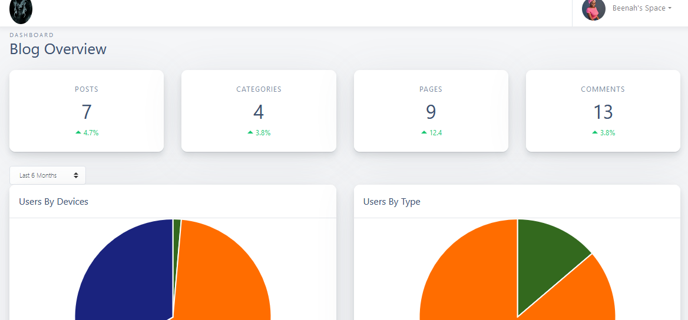
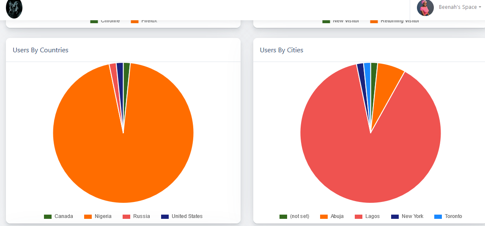
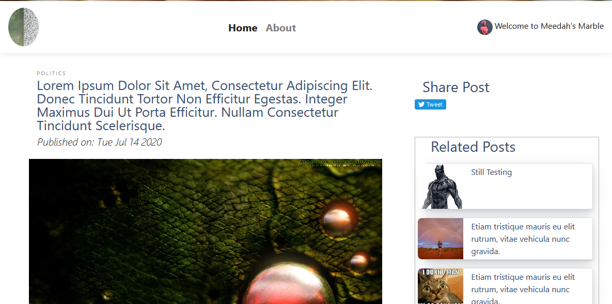
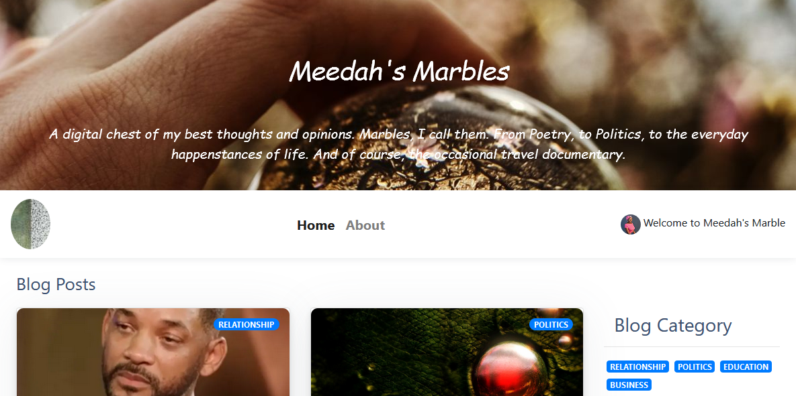
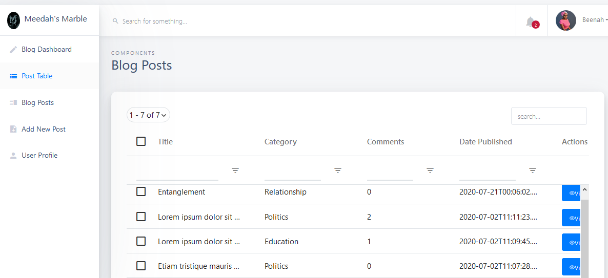
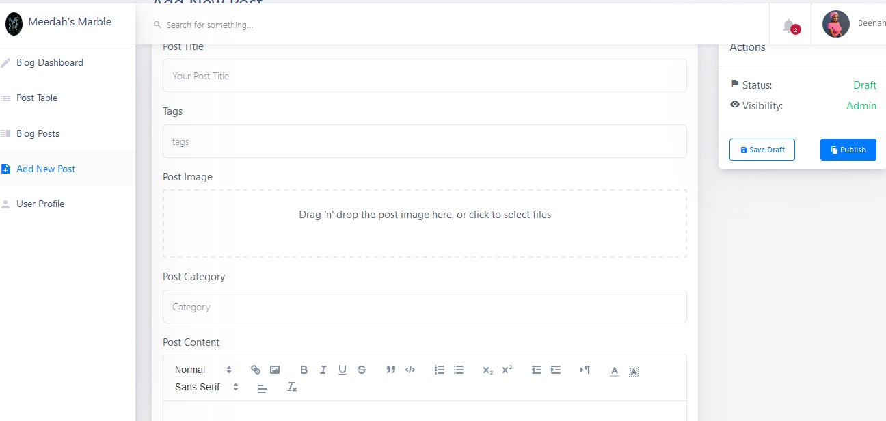
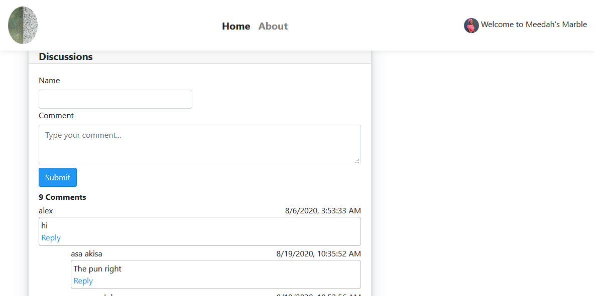
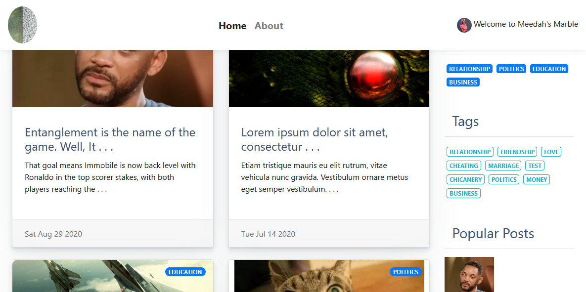
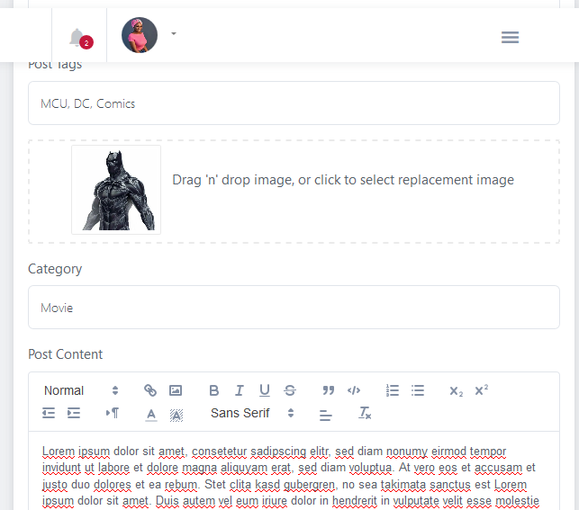
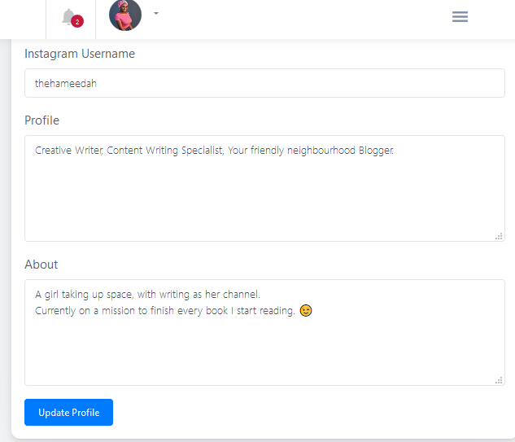

# CMS Client

 

## :rocket: Features of this Application

- Visitors can see all blog posts.

- Visitors can view a blog post.

- Visitors can make comments on a blog post.

- Visitors can reply a comment.

- Visitors can share posts via SM platforms

- Visitors can filter posts by tags and categories

- Visitors can subscribe and receive new posts notification.

- Admin can sign in

- Admin can receive notifications when readers comment

- Admin can create, read, edit and delete drafts

- Admin can publish drafts as blog posts

- Admin can read, edit, and delete published blog posts

- Admin can track analytics on the blog's dashboard

<!-- ## :camera_flash: Screenshots
|                           |                            |
| :----------------------------------: | :----------------------------------: |
|  |  |
|  |  |
|  |  |
|  |  |
|  |  |
 -->

## :snail: TODO

- Admin should be able to moderate, and delete comments
- Admin should be able to view the numbers and list of subscribers
- Admin should be able to filter by tags
- Include schedule post functionality
- Create a contact form 

### :classical_building: Project Structure
- This project is bootstrapped using [Create React App](https://github.com/facebook/create-react-app) and [Shards React](https://github.com/designrevision/shards-react)

## Requirements

Node

Git

Browser

See package.json for project dependencies and devDependencies

### Quick Start
* Install dependencies by running `npm install`.
* Run `npm run dev` to start the local development server.

 

### :building_construction: Built using

- [Next.js](https://nextjs.org)
- [Shards React](https://github.com/designrevision/shards-react)

 

## :star: Contributing
This project was started with the intention of facilitating learning and that hasn't changed. Contributons, comments, and PRs are all welcome.
Consider running the [CMS SERVER REST API project](https://github.com/Dendekky/mm-server) locally during development.

## :bearded_person: Author
[Ibrahim Adeniyi](https://dendekky.netlify.app)
